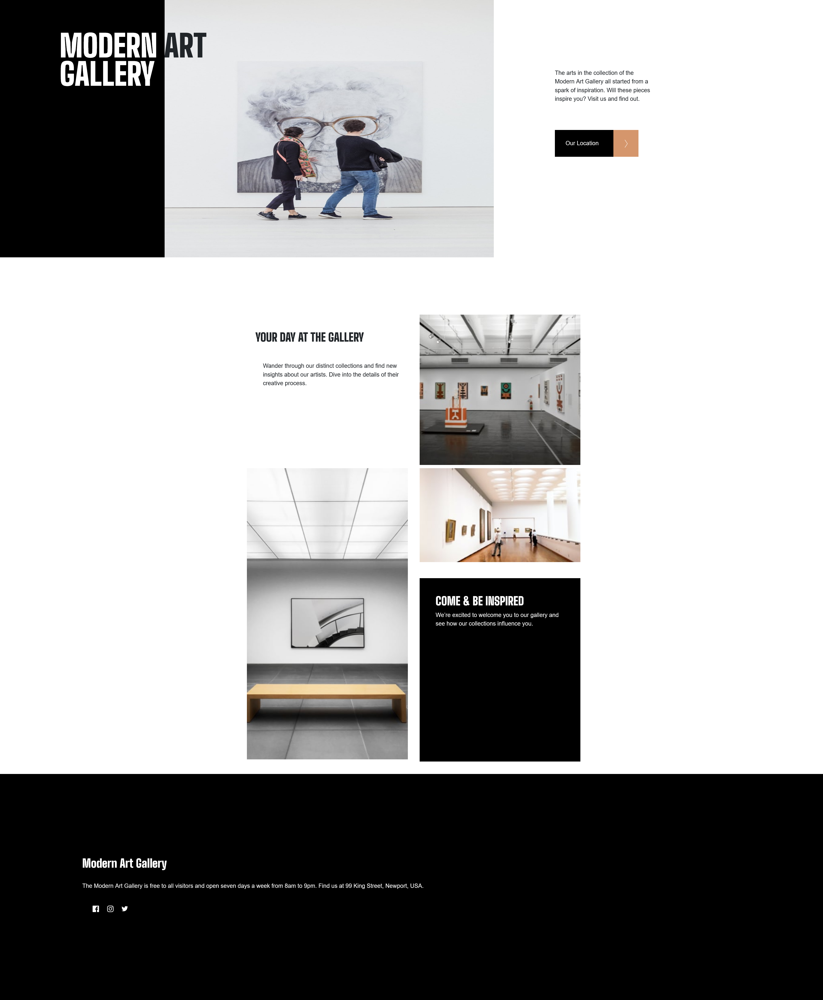

# Frontend Mentor - Art gallery website solution

This is a solution to the [Art gallery website challenge on Frontend Mentor](https://www.frontendmentor.io/challenges/art-gallery-website-yVdrZlxyA). Frontend Mentor challenges help you improve your coding skills by building realistic projects. 

## Table of contents

- [Overview](#overview)
  - [The challenge](#the-challenge)
  - [Links](#links)
- [My process](#my-process)
  - [Built with](#built-with)
  - [What I learned](#what-i-learned)
  - [Continued development](#continued-development)
- [Author](#author)
- [Screenshot](#screenshot)

## Overview

### The challenge

Users should be able to:

- View the optimal layout for each page depending on their device's screen size
- See hover states for all interactive elements throughout the site
- **Bonus**: Use [Leaflet JS](https://leafletjs.com/) to create an interactive location map with custom location pin

### Links

- Solution URL: https://www.frontendmentor.io/solutions/art-gallery-website-vj-yMrhrhH
- Live Site URL: https://keithgaines.github.io/art-gallery-website/

## My process

### Built with

- Semantic HTML5 markup
- CSS custom properties
- Flexbox
- CSS Grid
- Mobile-first workflow

### What I learned

Building my art gallery website was a journey filled with challenges and lessons. I discovered the power of media calls and how they impact the way my website appears on different devices. I faced obstacles, but I didn't give up and I finally figured out how to make my site responsive. The feeling of accomplishment is indescribable now that my website provides a seamless viewing experience for all users. I am proud of my perseverance and determination that helped me achieve my goal. I have learned a valuable skill that will be incredibly useful in future projects.

### Continued development

As a developer, I am dedicated to improving my skills in media calls and responsive design. These techniques are crucial for optimizing websites and apps for mobile devices, ensuring a consistent and visually appealing design for all users. I am committed to using media calls to create unique styles for various screen sizes and devices, and my proficiency in responsive design guarantees a seamless user experience across all devices and screen sizes. By staying current with the latest best practices, I am able to provide the best possible user experience for my clients and users.

## Author

- Website - [Keith Gaines](https://keithgaines.github.io)
- Frontend Mentor - [@keithgaines](https://www.frontendmentor.io/profile/keithgaines)

### Screenshot

